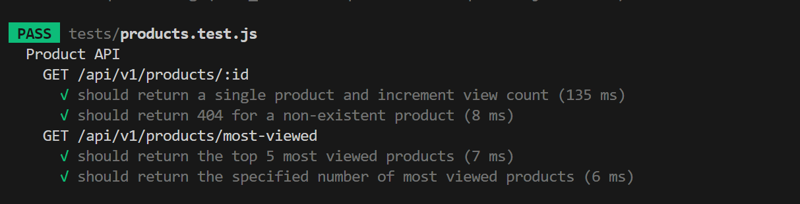

# Product API Documentation

## Overview
The Product API allows you to manage and retrieve product information and convert product prices into different currencies.

## Base URL
```
http://localhost:4000/api
```

## API Versioning
This API supports versioning. The following versions are available:

- v1

## Endpoints

### 1. Get a Single Product

**GET** `/v1/products/:id`

**Description**: Retrieves details of a single product by its ID and increments its view count.

#### Request Parameters
- `id` (path parameter): The unique identifier of the product.
- `currency` (query parameter, optional): Specify the currency for the price conversion. Supported currencies are:
  - USD
  - CAD

#### Response
- **Status Code**: 
  - 200 OK: Successful retrieval.
  - 404 Not Found: Product does not exist.
  
#### Example
**Request**
```http
GET /api/v1/products/1?currency=CAD
```

**Response**
```json
{
    "error": null,
    "result": {
        "id": 1,
        "name": "Kawasaki Ninja 650",
        "price": 14.3022075,
        "description": null,
        "isDeleted": 0,
        "productViewed": 4,
        "createdDate": "2022-07-07T00:00:00.000Z",
        "updatedDate": "2024-10-07T20:03:33.000Z",
        "deletedDate": null
    }
}
```

---

### 2. List Most Viewed Products

**GET** `/v1/products/most-viewed`

**Description**: Retrieves a list of the most viewed products. Returns the top 5 by default but can be customized.

#### Query Parameters
- `limit` (query parameter, optional): Number of products to return (default is 5).
- `currency` (query parameter, optional): Specify the currency for the price conversion. Supported currencies are:
  - USD
  - CAD

#### Response
- **Status Code**: 
  - 200 OK: Successful retrieval.

#### Example
**Request**
```http
GET /api/v1/products/most-viewed?limit=3&currency=USD
```

**Response**
```json
{
    "result": [
        {
            "id": 3,
            "name": "Kawasaki Ninja 850",
            "price": 12.33,
            "description": null,
            "isDeleted": 0,
            "productViewed": 7,
            "createdDate": "2022-07-07T00:00:00.000Z",
            "updatedDate": "2024-10-07T20:06:51.000Z",
            "deletedDate": null
        },
        {
            "id": 1,
            "name": "Kawasaki Ninja 650",
            "price": 10.5,
            "description": null,
            "isDeleted": 0,
            "productViewed": 4,
            "createdDate": "2022-07-07T00:00:00.000Z",
            "updatedDate": "2024-10-07T20:03:33.000Z",
            "deletedDate": null
        },
        {
            "id": 5,
            "name": "Kawasaki Ninja 1000",
            "price": 17.95,
            "description": null,
            "isDeleted": 0,
            "productViewed": 3,
            "createdDate": "2022-07-07T00:00:00.000Z",
            "updatedDate": "2024-10-07T20:16:35.000Z",
            "deletedDate": null
        }
    ],
    "error": null
}
```

---


## Environment Variables
```
DB_USERNAME=
DB_PASSWORD=
DB_HOST=
DB_NAME=
SERVER_PORT=4000
CURRENCY_LAYER_API_KEY=
```
## Running Server
To run the node js server,
-  perform an `npm i` to install all the required dependencies.
- copy `.env.default` as `.env` file and fill out the environment variables
- perform `npm run start` to start the server.

## Running Tests
To run the tests, you will need to create a new database called 'lynx_jest_test' and seed the table product using insert commands of product.sql. After seeding, 
- Run `npm run test` to run the tests.
Example Result of test run:



## Postman file
Postman json file can be found at the submission folder `submission/postman.json`

